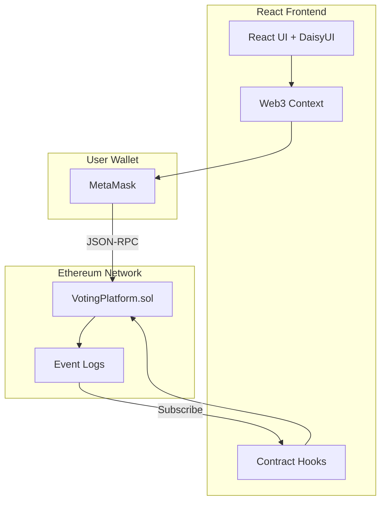

# VoteChain — Decentralized Voting Platform

[](https://github.com/salim-lakhal/Decentralized-Voting-Platform/actions/workflows/ci.yml)
[](LICENSE)
[](https://soliditylang.org/)
[](https://reactjs.org/)
[](https://hardhat.org/)

A trustless, on-chain voting platform where elections are transparent, votes are immutable, and no central authority controls the outcome. Built with Solidity smart contracts on Ethereum and a React frontend.

> **Why decentralized voting?** Traditional voting systems rely on trusted intermediaries — election boards, databases, administrators. A single point of failure or corruption can undermine the entire process. By moving elections to the blockchain, every vote is publicly verifiable, tamper-proof, and censorship-resistant.

## Demo

[](https://github.com/salim-lakhal/Decentralized-Voting-Platform/releases/download/v1.0/demo.mp4)
> *Click to watch the full demo video*

## Architecture



The platform follows a standard DApp architecture:
1. **Smart Contract** — All election logic lives on-chain. The `VotingPlatform` contract manages election lifecycle, candidate registration, vote casting, and result tallying.
2. **React Frontend** — A single-page app that reads contract state and sends transactions through the user's wallet.
3. **MetaMask** — Acts as the signer and transaction gateway. No backend server or database required.

## Smart Contract Design

The `VotingPlatform` contract implements:

| Feature | Description |
|---------|-------------|
| **Election Lifecycle** | Admin creates time-bound elections with start/end timestamps |
| **Candidate Registration** | Candidates added before election starts, stored on-chain |
| **One Vote Per Address** | `mapping(electionId => mapping(address => bool))` prevents double voting |
| **Transparent Results** | Anyone can query results after the election ends |
| **Event Emission** | `ElectionCreated`, `CandidateAdded`, `VoteCast` events for off-chain indexing |

### Access Control
- Only the contract deployer (admin) can create elections and add candidates
- Any address can vote once per election during the active period
- Results are public and queryable by anyone after the election ends

## Tech Stack

| Layer | Technology |
|-------|-----------|
| Smart Contracts | Solidity 0.8.20 |
| Contract Framework | Hardhat |
| Frontend | React 18, React Router 6 |
| Styling | Tailwind CSS, DaisyUI |
| Blockchain Interaction | ethers.js v6 |
| Wallet | MetaMask |
| Testing | Hardhat + Chai (contracts), Jest + React Testing Library (frontend) |
| CI/CD | GitHub Actions |

## Getting Started

### Prerequisites

- Node.js 18+
- MetaMask browser extension

### Install

```bash
git clone https://github.com/salim-lakhal/Decentralized-Voting-Platform.git
cd Decentralized-Voting-Platform
npm install
```

### Run Locally

```bash
# Terminal 1: Start local Hardhat blockchain
npx hardhat node

# Terminal 2: Deploy contracts + seed demo data
npx hardhat run scripts/deploy.js --network localhost

# Terminal 3: Start the frontend
npm start
```

Then connect MetaMask to `localhost:8545` (Chain ID: 31337) and import one of the Hardhat test accounts.

### Run Tests

```bash
# Smart contract tests
npx hardhat test

# Frontend tests
npm test
```

## Project Structure

```
├── contracts/
│   └── VotingPlatform.sol      # Core voting smart contract
├── scripts/
│   └── deploy.js               # Deployment + demo seed script
├── test/
│   └── VotingPlatform.test.js  # Contract test suite
├── src/
│   ├── context/Web3Context.js  # Wallet connection state
│   ├── hooks/useVotingContract.js
│   ├── pages/                  # Route-level components
│   │   ├── Home.js
│   │   ├── Elections.js
│   │   ├── ElectionDetail.js
│   │   └── Admin.js
│   └── components/             # Shared UI components
│       ├── Header.js
│       └── Footer.js
├── hardhat.config.js
├── tailwind.config.js
└── package.json
```

## Security Considerations

- **Reentrancy**: Vote function follows checks-effects-interactions pattern — state is updated before any external calls
- **Access Control**: Admin-only functions use `onlyAdmin` modifier; no proxy pattern means admin cannot be changed post-deployment
- **Integer Overflow**: Solidity 0.8+ has built-in overflow checks
- **Timestamp Dependence**: Elections use `block.timestamp` which miners can manipulate by ~15 seconds — acceptable for elections measured in hours/days
- **Front-Running**: Vote transactions are visible in the mempool before confirmation. For high-stakes elections, a commit-reveal scheme would be needed (not implemented here as it adds significant UX complexity)
- **No Upgradability**: Contract is immutable once deployed — this is intentional for trustlessness

## Deployment

To deploy on Sepolia testnet:

```bash
cp .env.example .env
# Edit .env with your Sepolia RPC URL and deployer private key
npx hardhat run scripts/deploy.js --network sepolia
```

## License

[MIT](LICENSE)
